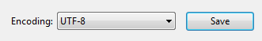
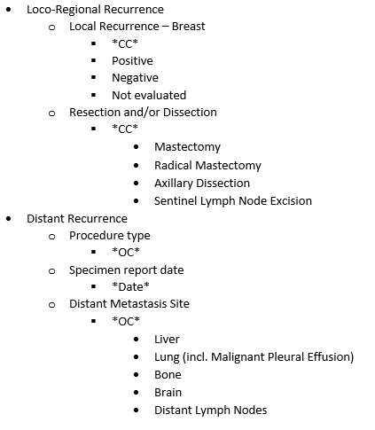

# LabKeySchemaToMetadataConverter
Converts text file annotation schemas into metadata JSON files useable by LabKey Software

## Instructions for Converting Files
This manual assumes the user is using Windows and is familiar with navigating through directories in a command prompt.
Here is a [command prompt tutorial](https://www.computerhope.com/issues/chusedos.htm "Computer Hope Command Line Guide") and [another one just about navigation](http://www.pcstats.com/articleview.cfm?articleid=1723&page=3) for reference.

### Setup

1. Click the green "Clone or download" button on the GitHub repository's main page and click "Download ZIP"
2. Find downloaded folder, right click it to bring up a menu, and proceed with "Extract All"
3. Keep track of the location of the extracted LabKeySchemaToMetadataConverter folder

### Input

The script requires a text file (.txt) of the schema.

Schemas are created as Microsoft Word files (.docx) with a format described later in this readme. To create the text file of the schema:
1. Create a new text (.txt) file
2. Open the Word schema file
3. Copy and paste the contents of the Word file into the empty text file. The bullets will appear as strange symbols and the spacing will appear wrong, but this is expected.
4. Save the file, ensuring that the encoding is "UTF-8"

###### Saving the File

In Notepad, click "File"->"Save As". Near the "Save" button there should be options for "Encoding":


Select "UTF-8":



If run into the following message, click "Cancel" and follow the directions above:


### Run Converter

Navigate to the LabKeySchemaToMetadataConverter folder in the command prompt.
Use the following command:

```convert_schema_to_json.cmd SCHEMA_FILE```

where SCHEMA_FILE is the name (or path from the current folder) of the schema text file you wish to convert. For example, if the schema file is named biomarker_schema_4.txt in the folder C:\Documents\Schemas, then the command would be:

```convert_schema_to_json.cmd C:\Documents\Schemas\biomarker_SCHEMA_v4.txt```


### Output

The script will produce a .json file of the same name as the schema file, except for swapping "SCHEMA" for "METADATA", and put it in the same location.
So in the example above, the script will create "biomarker_METADATA_v4.json" and
put it in C:\Documents\Schemas

The text file with the Microsoft Word schema contents will also be formatted into the text file schema format, described below.


## Annotation Schema Format - Microsoft Word File
LabKey annotation schemas may be Microsoft Word files (.docx) that consist of fields which are divided into sections.

Each field must specify:
* Its data type, one of [OC, CC, Date]
    * Open Class (OC) indicates a value may either be manually entered into the field, or selected from the dropdown list
	* Closed Class (CC) indicates a value can only be selected from the dropdown list
	* Date indicates a value to be selected from a calendar
* Possible values to be listed in its dropdown list (if applicable)


**Template:**


**Example:**




## Annotation Schema Format - Text File

Another format option for LabKey annotation schemas are to directly create manually formatted text files (.txt). Using this option, there's no need to convert from a Word document.

*To convert this type of schema to a json metadata file, use "convert_text_file_formatted_schema_to_json.cmd" instead of "convert_schema_to_json.cmd" while following the "Run Converter" instructions above*


Each field must specify:
* Its data type, one of [OC, CC, Date]
    * Open Class (OC) indicates a value may either be manually entered into the field, or selected from the dropdown list
	* Closed Class (CC) indicates a value can only be selected from the dropdown list
	* Date indicates a value to be selected from a calendar
* Possible values to be listed in its dropdown list (if applicable)


**Template:**

```
Section Name 1
	Field Name 1
		*Field data type*
		Dropdown Option 1
		Dropdown Option 2
		...
	Field Name 2
		*Field data type*
		Dropdown Option 1
		Dropdown Option 2
		...
	...
Section Name 2
	Field Name 1
		*Field data type*
		Dropdown Option 1
		Dropdown Option 2
		...
	Field Name 2
		*Field data type*
		Dropdown Option 1
		Dropdown Option 2
		...
	...
...
```

**Example:**

```
Loco-Regional Recurrence
	Local Recurrence - Breast
		*CC*
		Positive
		Negative
		Not evaluated
	Resection and/or Dissection
		*CC*
		Mastectomy
		Radical Mastectomy
		Axillary Dissection
		Sentinel Lymph Node Excision
Distant Recurrence
	Procedure type
		*OC*
	Specimen report date
		*Date*
	Distant Metastasis Site
		*OC*
		Liver
		Lung (incl. Malignant Pleural Effusion)
		Bone
		Brain
		Distant Lymph Nodes
```


Spacing indicates whether something is a section, field, or field property:
* 0 tabs = Section
* 1 tab =  Field
* 2 tabs = Datatype or Dropdown List Option


## Notes for Schema Creators

The schema cannot contain:
* Double quote characters ["]. Any found in the file will be converted to single quotes ['].
* Non-ASCII/Extended-ASCII characters (i.e. less common special characters, characters from non-English languages). Any found will be replaced or removed.

The conversion script has functionality to make schema development easier:
1. The script will check for schema validity.
2. Capitalization for anything and asterisks for datatypes are not necessary.
3. An additional script is available to automatically [add asterisks to datatypes](Converter_Files/format_field_datatypes.py) in an otherwise completed text file formatted schema, if desired.


## Notes for Metadata Managers

After conversion, the metadata file needs to have a quick processing step before being loaded into LabKey.
This entails having carriage return characters stripped out of it.

One way to accomplish this is to
1. Open the json file in Notepad++
2. Press CTRL+H to bring up the Find/Replace screen
3. In the "Search Mode" section of the radial buttons, make sure "Extended" is activated
4. In "Find what", enter "\r"
5. In "Replace with", make sure the field is empty
6. Hit "Replace All"

One way to check for carriage return characters in the file
1. Open the json file in Notepad++
2. Go to View > Show Symbol > Show All Characters
3. Carriage returns will appear as a box with the letters "CR"


## Summary of Conversion Steps

Standard:
1. Obtain MS Word schema
2. Copy schema contents and paste into a new .txt file
3. Run the converter script with this .txt file
4. Remove carriage returns from the generated .json file
5. Install .json file into LabKey

Alternative:
1. Obtain text file formatted schema
2. Run the converter script with this file
3. Remove carriage returns from the generated .json file
4. Install .json file into LabKey